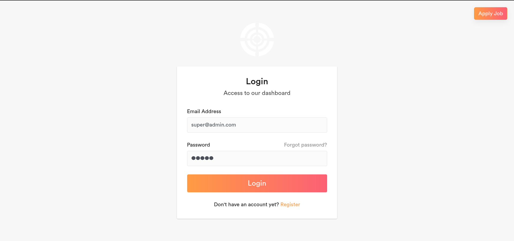
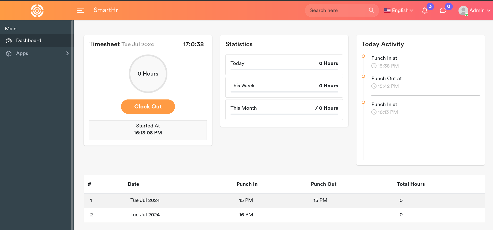
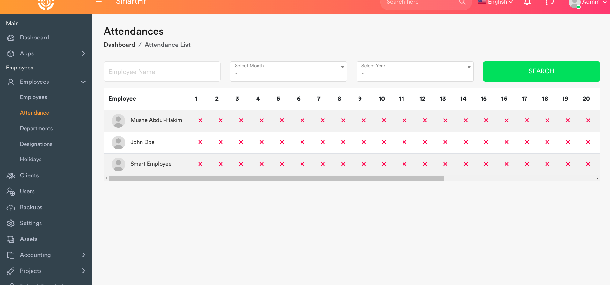
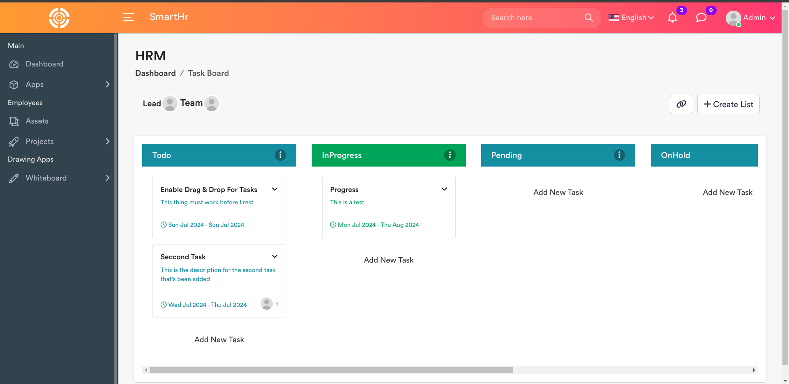
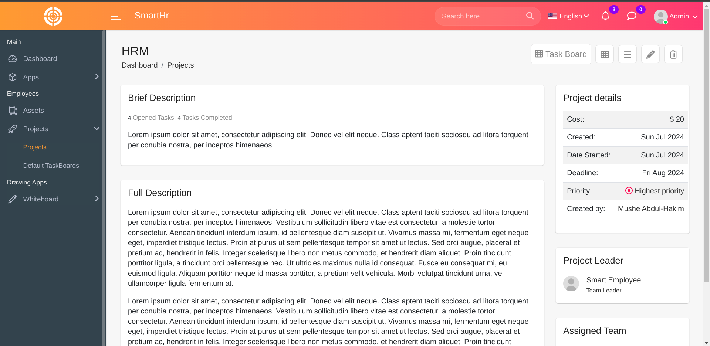
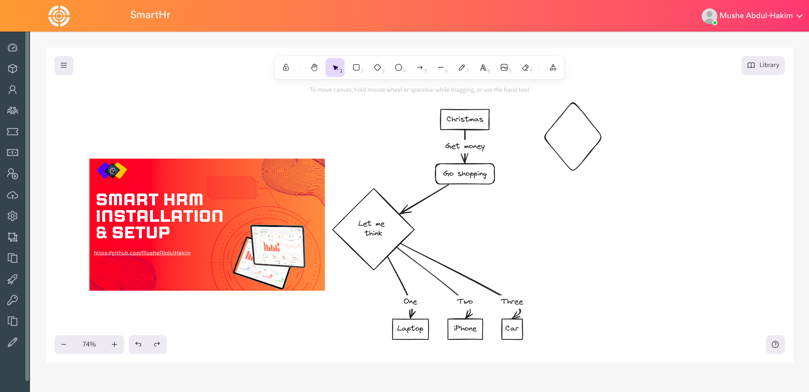

<div align="center">

# 🚀 SmartHR - Human Resource Management System

### 💼 Modern HRMS Built with Laravel

<p align="center">
Enterprise-grade Human Resource Management System (HRMS) with Employee Management, Payroll, Attendance, Projects, Accounting, Chat, and Role-Based Access Control.
</p>

<p align="center">


</p>

---

⭐ Star this repository if you like it ⭐

</div>

---

# 📌 Overview

SmartHR is a **Laravel-based Human Resource Management System (HRMS)** that helps organizations manage employees, payroll, attendance, projects, accounting, tickets, and internal communication through a secure and modular platform.

---

# ✨ Features

✅ Employee Management

✅ Attendance Management

✅ Payroll System

✅ Leave Management

✅ Project Management

✅ Kanban Task Board

✅ Ticket Support

✅ Internal Chat

✅ Accounting & Invoicing

✅ Role-Based Access Control (RBAC)

✅ REST API Ready

---

# 🛠 Tech Stack

| Category | Technologies |
|----------|--------------|
| Backend | Laravel, PHP |
| Frontend | HTML, CSS, JavaScript, Bootstrap |
| Database | MySQL |
| Authentication | Laravel Authentication |
| Tools | Composer, NPM, Git |
| Architecture | Modular Monolith |

---

# 📸 Screenshots

## 🔐 Login



---

## 👨‍💼 Employee Dashboard



---

## 📅 Attendance Table



---

## 📊 Attendance Details


---

## 📋 Task Board



---

## ➕ Add Task


---

## 📁 Projects


---

## 📄 Project Details



---

## 💬 Chat Application


---

## 🎫 Ticket Chat


---

## 💰 Payslip


---

## 📑 Payslip Items


---

## 🎨 Excalidraw



---

## 📐 TLDraw


---

# 🏗 Project Modules

```
SmartHR
│
├── Employee Management
├── Attendance
├── Payroll
├── Leave Management
├── Projects
├── Kanban Board
├── Accounting
├── Ticket System
├── Chat Application
├── Authentication
└── RBAC
```

---

# 🚀 Installation

```bash
git clone https://github.com/USERNAME/laravel-smarthr.git

cd laravel-smarthr

composer install

npm install

npm run build

cp .env.example .env

php artisan key:generate

php artisan migrate:fresh --seed

php artisan storage:link

php artisan serve
```

---

# 🔑 Demo Login

## 👑 Admin

Email

```
superadmin@smarthr.com
```

Password

```
password
```

---

## 👤 Employee

Email

```
employee@smarthr.com
```

Password

```
password
```

---

## 👥 Client

Email

```
client@smarthr.com
```

Password

```
password
```

---

# 📂 Folder Structure

```
app/
Modules/
resources/
routes/
database/
storage/
public/
```

---

# 🎯 Learning Outcomes

- Laravel MVC
- RBAC Authentication
- Modular Architecture
- Payroll Management
- Employee Management
- Database Design
- REST APIs
- Project Management
- Git Workflow

---

# 📈 Future Improvements

- 🤖 AI Resume Screening

- 📱 Mobile App

- 📧 Email Notifications

- 📊 Advanced Analytics

- 😊 Face Recognition Attendance

- 🔔 Push Notifications

---

# 🤝 Contributing

Contributions are welcome!

Fork the repository

Create your feature branch

Commit your changes

Push your branch

Open a Pull Request

---

# ⭐ Support

If you found this project useful,

⭐ Star this repository

🍴 Fork it

📢 Share it

---

# 📜 License

Distributed under the MIT License.

---

<div align="center">

## 👨‍💻 Developer

### Mohamed Rizwan R

🌐 Portfolio

https://mdrizwan27.pages.dev

💼 LinkedIn

https://linkedin.com/in/mdrizwanr

🐙 GitHub

https://github.com/mohamedrizwan4518

---

Made with ❤️ using Laravel

⭐ Don't forget to Star this Repository ⭐

</div>
